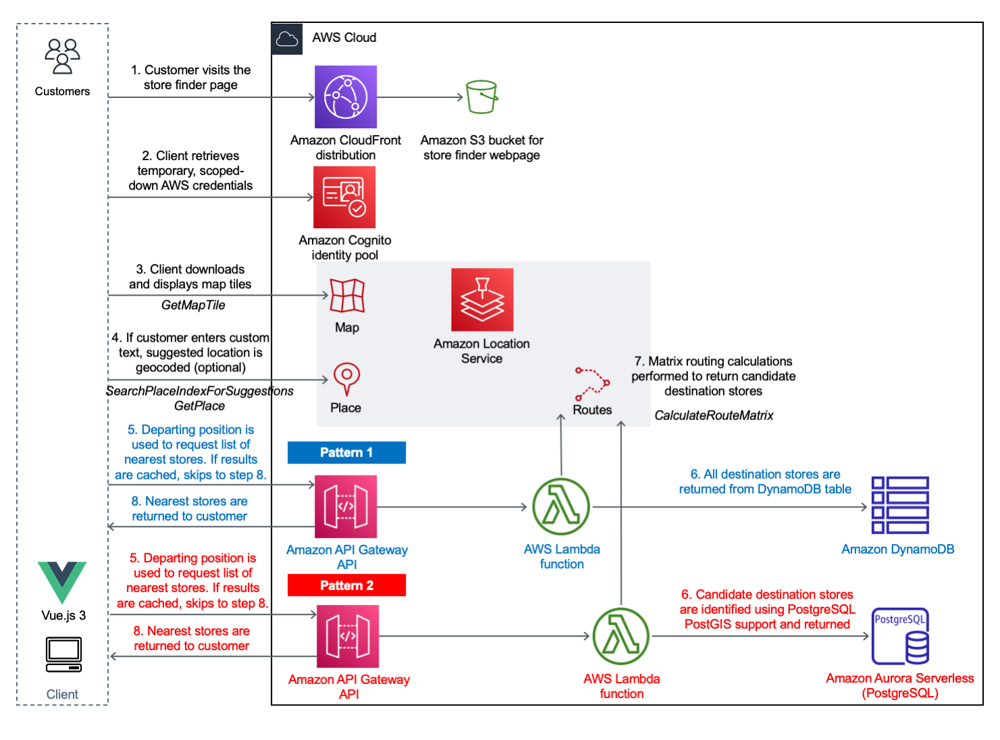

# Build a serverless store finder site using Amazon Location Service

## Introduction

This repository demonstrates how [Amazon Location Service](https://aws.amazon.com/location/)'s Maps, Places and Routing APIs can be used to implement a simple "store finder" web page which lists the physical stores that are most accessible to the customer, along with pertinent store information such as opening hours and address. 

There are 2 back-end approaches being demonstrated by this solution to address 2 customer use-cases. Both approaches share the identical [Vue.js 3.0](https://vuejs.org/) front-end, which provides the user with the ability to select their current or future departure location. Depending on the pattern in use, the front-end invokes the corresponding back-end API to return the destination stores nearest to the submitted departure point.

### API patterns

- **Pattern 1** - The store information is stored in an Amazon DynamoDB table. All stores are returned by the AWS Lambda function and evaluated using Amazon Location Service's Routing API. The refined, sorted results are then returned back to the end user via Amazon API Gateway. This approach is recommended for a business with a small number of stores.
- **Pattern 2** The store information is stored in an Amazon Aurora Serverless V2 (PostgreSQL) database. A subset of stores is initially returned by the AWS Lambda function using PostgreSQL's [PostGIS](https://postgis.net/) geospatial extension. This finite list is then evaluated using Amazon Location Service's Routing API, and sorted results are then returned back to the end user via Amazon API Gateway. This approach is recommended for a business with a large number of stores.

Both methods leverage caching on Amazon API Gateway to ensure frequent requests are responded to quickly, and cost-effectively. 

### Solution overview



### Blog post

The below blog post covers this solution in more detail.

//TODO: Link to blog post

## Getting started

### Prerequisites

1. Both API patterns are deployed using the [AWS Serverless Application Model (SAM)](https://aws.amazon.com/serverless/sam/). Follow the steps in the [official documentation](https://docs.aws.amazon.com/serverless-application-model/latest/developerguide/install-sam-cli.html) to install the latest release of the AWS Serverless Application Model Command Line Interface (CLI) for your operating system.
  Once successfully installed, running `sam --version` will return the SAM CLI version.
  >The AWS SAM CLI requires appropriate permissions to provision resources in the chosen AWS account. Ensure that [access key and secret access keys](https://docs.aws.amazon.com/serverless-application-model/latest/developerguide/prerequisites.html) have been created using AWS IAM, and that `aws configure` has been used to register them locally on your machine.
2. The store finder front-end has been developed using the [Vue.js 3.0](https://vuejs.org/) framework. All front-end code, back-end code and AWS SAM templates required by both API patterns are stored in the [serverless-store-finder repository](https://github.com/aws-samples/serverless-store-finder). Run `git clone` to download all required files to your local machine.
```
git clone https://github.com/aws-samples/serverless-store-finder
```
3. Navigate to the root of the downloaded repository and install all the dependencies.
```
cd serverless-store-finder
npm install
```
4. Finally, copy the `.env.local.template` file and rename it to`.env.local` so that it is ready to be populated by the outputs from the later AWS SAM template deployments.
```
cp .env.local.template .env.local
```
You are now ready to deploy the AWS SAM templates.

## AWS SAM deployments

### Store Finder - Core

The "Store Finder - Core" AWS SAM template will deploy the shared infrastructure resources required by both patterns, including the Amazon S3 bucket and Amazon CloudFront distribution for front-end hosting, Amazon Location Service map, place index and route calculator resources, and an Amazon Cognito user pool. 

1. Navigate to the `sam/core` directory on your local machine. Run `sam build` to build the application ready for deployment. Confirm that the `Build Succeeded` message is shown before continuing. 
```
cd sam/core
sam build
```
2. Run `sam deploy --guided`, selecting your environment-specific options when prompted. 
```
sam deploy --guided
```
When prompted enter the details chosen for your environment (you can keep the remainder as defaults):
```
Setting default arguments for 'sam deploy'
=========================================
Stack Name [sam-app]: <Your Store Finder "Core" Amazon CloudFormation stack name>
AWS Region [eu-west-1]: <Your AWS Region>                                  
Parameter storeFinderFrontendS3BucketName []: <Your unique Amazon S3 bucket name for front-end files hosting>
```
3. Confirm that the `Successfully created/updated stack` message is shown. Populate the missing Amazon Location Service and Amazon Cognito details in the `.env.local` file with details from the outputs of the deployed Amazon CloudFormation stack.
```
VITE_AWS_REGION=<You AWS Region>
VITE_AMAZON_COGNITO_IDENTITY_POOL_ID=<storeFinderAmazonCognitoIdentityPoolName from the Store Finder "Core" Amazon CloudFormation stack output>
VITE_AMAZON_LOCATION_SERVICE_MAP=<storeFinderAmazonLocationServiceMapName from the Store Finder "Core" Amazon CloudFormation stack output>
VITE_AMAZON_LOCATION_SERVICE_PLACES_INDEX=<storeFinderAmazonLocationServicePlaceIndexName from the Store Finder "Core" Amazon CloudFormation stack output>
```

### Store Finder - API Pattern 1

1. Navigate to the `sam/api-pattern1` directory on your local machine. Run `sam build` to build the application ready for deployment. Confirm that the `Build Succeeded` message is shown before continuing.
```
cd ../api-pattern1
sam build
```
2. Run `sam deploy --guided`, providing your environment-specific parameters.
```
sam deploy --guided
```
When prompted enter the details chosen for your environment (you can keep the remainder as defaults):
```
Setting default arguments for 'sam deploy'
=========================================
Stack Name [sam-app]: <Your Store Finder "API1" Amazon CloudFormation stack name>
AWS Region [eu-west-1]: <Your AWS Region>
Parameter storeFinderCoreCloudFormationStackName []: <Name of the Store Finder "Core" Amazon CloudFormation stack name>
```
3. Confirm that the `Successfully created/updated stack` message is shown. Populate the missing API1 endpoint value in the `.env.local` file with details from the outputs of the deployed Amazon CloudFormation stack.
```
VITE_APIGATEWAY_ENDPOINT_API1=<storeFinderAPIGatewayEndpoint from the Store Finder "API1" Amazon CloudFormation stack output>
```
> The Pattern 1 AWS SAM template houses an [AWS Lambda custom resource](https://docs.aws.amazon.com/AWSCloudFormation/latest/UserGuide/template-custom-resources.html) that will automatically load the stores data from the `stores.json` file. No further action is required, and API1 is now ready.

### Store Finder - API Pattern 2

1. Navigate to the `sam/api-pattern2` directory on your local machine. Run `sam build` to build the application ready for deployment. Confirm that the `Build Succeeded` message is shown before continuing.
```
cd ../api-pattern2
sam build
```
2. Run `sam deploy --guided`, providing your environment-specific parameters.
```
sam deploy --guided
```
When prompted enter the details chosen for your environment (you can keep the remainder as defaults):
```
Setting default arguments for 'sam deploy'
=========================================
Stack Name [sam-app]: <Your Store Finder "API2" Amazon CloudFormation stack name>
AWS Region [eu-west-1]: <Your AWS Region>
Parameter storeFinderCoreCloudFormationStackName []: <Name of the Store Finder "Core" Amazon CloudFormation stack>
Parameter storeFinderAuroraDBMasterUserName [admin_user] <Name of the PostgreSQL admin user account>: 
Parameter storeFinderDataImportS3BucketName []: <Amazon S3 bucket name used for the data import>
```
3. Confirm that the `Successfully created/updated stack` message is shown. Populate the missing API2 endpoint value in the `.env.local` file with details from the outputs of the deployed Amazon CloudFormation stack.
```
VITE_APIGATEWAY_ENDPOINT_API2=<storeFinderAPIGatewayEndpoint from Store Finder "API2" Amazon CloudFormation Stack output>
```
> Pattern 2 requires a CSV file to be manually uploded to the newly created Amazon S3 bucket. This will trigger an AWS Lambda function which will automatically insert the records into the PostgreSQL database.
4. Download, unzip and upload the [us-post-offices.csv](https://dataverse.harvard.edu/dataset.xhtml?persistentId=doi:10.7910/DVN/NUKCNA) file to the Amazon S3 API2 data assets bucket. The `aws s3 cp` command can be used to do this from the folder in which it was downloaded and unzipped.
```
aws s3 cp us-post-offices.csv s3://<storeFinderDataImport3Bucket from the Store Finder "API2" Amazon CloudFormation Stack output>`
```

### Build and deploy the Vue.js application

1. Confirm that all the missing details have now been populated in the `.env.local` file, then run `npm run build` in the root of the folder structure.
```
npm run build
```
2. Confirm that the deployment files have been successfully created in the `/dist` directory.
```
cd dist
ls
```
3. Upload the files in the `dist` folder to the Amazon S3 core hosting bucket.
```
aws s3 cp . s3://<storeFinderFrontendS3BucketUploadLocation from Store Finder "Core" Amazon CloudFormation Stack output> --recursive
```
> Note that if you make subsequent changes to the `.env.local` file, you will need to rebuild the Vue.js application, upload the results and invalidate the Amazon Route 53 distribution cache.
 
## Accessing the site
You can now access the site by visiting the URL of the Amazon CloudFormation distribution. You can find out what this is by checking `storeFinderAmazonCloudFrontDistributionUrl` from the output of the Store Finder "Core" Amazon CloudFormation stack.
