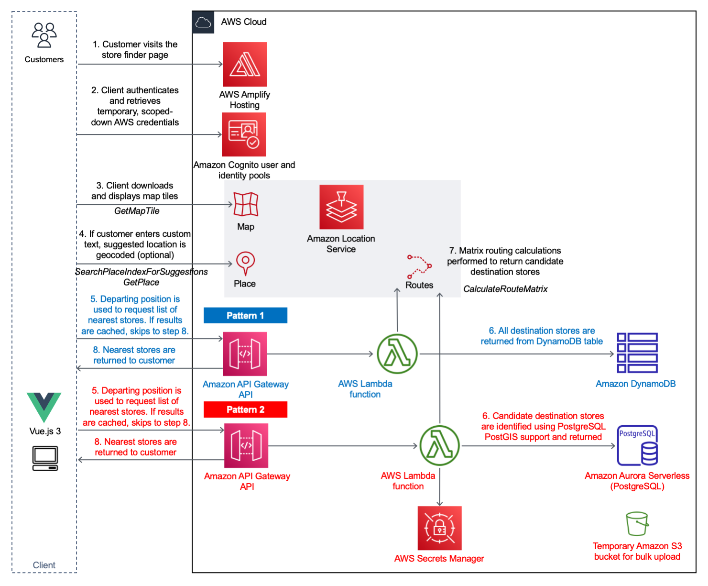
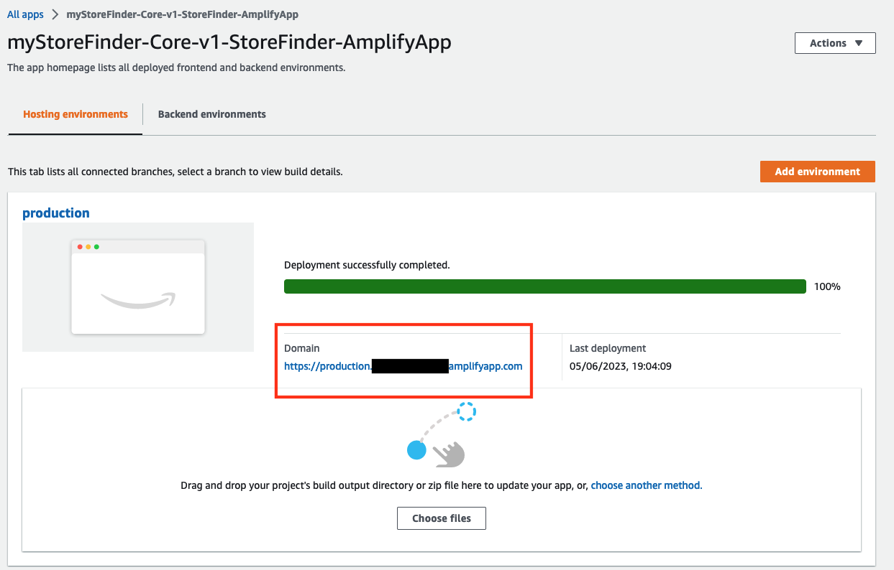
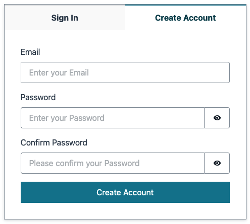
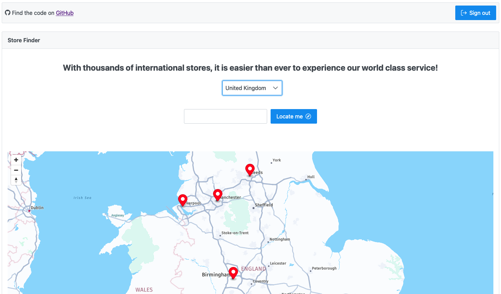

# Build a serverless store finder site using Amazon Location Service

## Introduction

This repository demonstrates how [Amazon Location Service](https://aws.amazon.com/location/)'s Maps, Places and Routing APIs can be used to implement a simple "store finder" web page which lists the physical stores that are most accessible based on a customer's location, along with pertinent store information such as opening hours and address. 

There are 2 back-end approaches being demonstrated by this solution to address 2 different customer categories. Both approaches share the identical [Vue.js 3.0](https://vuejs.org/) front-end, which provides the user with the ability to select their current location or select a reference location using the Suggestions API. Depending on the pattern in use, the front-end invokes the corresponding back-end API to return the destination stores nearest to the submitted reference point.

### API patterns

- **Pattern 1** - The store information is stored in an Amazon DynamoDB table. All stores are returned by the AWS Lambda function and evaluated using Amazon Location Service's Routing API. The refined, sorted results are then returned back to the end user via Amazon API Gateway. This approach is recommended for a business with a small number of stores.
- **Pattern 2** - The store information is stored in an Amazon Aurora Serverless V2 (PostgreSQL) database. A subset of stores is initially returned by the AWS Lambda function using PostgreSQL's [PostGIS](https://postgis.net/) geospatial extension to execute a radial query. This finite list (all locations within a 25 miles radius distance) is sorted using straight line distance then evaluated using Amazon Location Service's Routing API. Sorting by straight line distance first helps reduce the cost associated with calling the Routes API. The shortest routes (based on response from Amazon Location Service) are then returned back to the end user via Amazon API Gateway. This approach is recommended for a business with a large number of stores.

Both methods leverage caching on Amazon API Gateway to ensure frequent requests are responded to quickly, and cost-effectively. 

### Solution overview



## Getting started

### Prerequisites

- You will require an AWS account, and sufficient AWS IAM permissions to deploy the resources into that account.
- The store finder front-end has been developed using the [Vue.js 3.0](https://vuejs.org/) framework. You will need to have [npm](https://www.npmjs.com/package/npm), the JavaScript package manager, installed on your machine.

### Downloading the code

1. Both API patterns are deployed using the [AWS Serverless Application Model (SAM)](https://aws.amazon.com/serverless/sam/). Follow the steps in the [official documentation](https://docs.aws.amazon.com/serverless-application-model/latest/developerguide/install-sam-cli.html) to install the latest release of the AWS Serverless Application Model Command Line Interface (CLI) for your operating system.
  Once successfully installed, running `sam --version` will return the SAM CLI version.
  >The AWS SAM CLI requires appropriate permissions to provision resources in the chosen AWS account. Ensure that [access key and secret access keys](https://docs.aws.amazon.com/serverless-application-model/latest/developerguide/prerequisites.html) have been created using AWS IAM, and that `aws configure` has been used to register them locally on your machine. 
2. All front-end code, back-end code and AWS SAM templates required by both API patterns are stored in the [serverless-store-finder repository](https://github.com/aws-samples/serverless-store-finder). Run `git clone` to download all required files to your local machine.
```
git clone https://github.com/aws-samples/serverless-store-finder
```
3. Navigate to the root of the downloaded repository and install all the dependencies.
```
cd serverless-store-finder
npm install
```
4. Finally, copy the `.env.local.template` file and rename it to`.env.local` so that it is ready to be populated by the outputs from the later AWS SAM template deployments.
```
cp .env.local.template .env.local
```
You are now ready to deploy the AWS SAM templates.

### AWS SAM deployments

#### Store Finder - Core

The "Store Finder - Core" AWS SAM template will deploy the shared infrastructure resources required by both patterns, namely the Amazon Location Service map, place index and route calculator resources, and Amazon Cognito user and identity pools. This AWS SAM template will also create an empty AWS Amplify app.

1. Navigate to the `sam/core` directory on your local machine. Run `sam build` to build the application ready for deployment. Confirm that the `Build Succeeded` message is shown before continuing. 
```
cd sam/core
sam build
```
2. Run `sam deploy --guided`, selecting your environment-specific options when prompted. 
```
sam deploy --guided
```
When prompted enter the details chosen for your environment (you can keep the remainder as defaults):
```
Setting default arguments for 'sam deploy'
=========================================
Stack Name [sam-app]: <Your Store Finder "Core" Amazon CloudFormation stack name>
AWS Region [eu-west-1]: <Your AWS Region>                                  
Parameter storeFinderFrontendS3BucketName []: <Your unique Amazon S3 bucket name for front-end files hosting>
```
3. Confirm that the `Successfully created/updated stack` message is shown. Populate the missing Amazon Location Service and Amazon Cognito details in the `.env.local` file with details from the outputs of the deployed Amazon CloudFormation stack.
```
VITE_AWS_REGION=<You AWS Region>
VITE_AMAZON_COGNITO_IDENTITY_POOL_NAME=<storeFinderAmazonCognitoIdentityPoolName from the Store Finder "Core" Amazon CloudFormation stack output>
VITE_AMAZON_COGNITO_USER_POOL_NAME=<storeFinderAmazonCognitoUserPoolName from the Store Finder "Core" Amazon CloudFormation stack output>
VITE_AMAZON_COGNITO_USER_POOL_CLIENT_NAME=<storeFinderAmazonCognitoUserPoolClientName from the Store Finder "Core" Amazon CloudFormation stack output>
VITE_AMAZON_LOCATION_SERVICE_MAP=<storeFinderAmazonLocationServiceMapName from the Store Finder "Core" Amazon CloudFormation stack output>
VITE_AMAZON_LOCATION_SERVICE_PLACES_INDEX=<storeFinderAmazonLocationServicePlaceIndexName from the Store Finder "Core" Amazon CloudFormation stack output>
```

#### Store Finder - API Pattern 1

The "Store Finder - API Pattern 1" AWS SAM template will deploy the back-end API infrastructure and code required by Pattern 1, including the Amazon API Gateway, AWS Lambda functions, and Amazon DynamoDB table. This API is fully functional itself and is not dependent on API Pattern 2.

1. Navigate to the `sam/api-pattern1` directory on your local machine. Run `sam build` to build the application ready for deployment. Confirm that the `Build Succeeded` message is shown before continuing.
```
cd ../api-pattern1
sam build
```
2. Run `sam deploy --guided`, providing your environment-specific parameters.
```
sam deploy --guided
```
When prompted enter the details chosen for your environment (you can keep the remainder as defaults):
```
Setting default arguments for 'sam deploy'
=========================================
Stack Name [sam-app]: <Your Store Finder "API1" Amazon CloudFormation stack name>
AWS Region [eu-west-1]: <Your AWS Region>
Parameter storeFinderCoreCloudFormationStackName []: <Name of the Store Finder "Core" Amazon CloudFormation stack name>
```
3. Confirm that the `Successfully created/updated stack` message is shown. Populate the missing API1 endpoint value in the `.env.local` file with details from the outputs of the deployed Amazon CloudFormation stack.
```
VITE_APIGATEWAY_ENDPOINT_API1=<storeFinderAPIGatewayEndpoint from the Store Finder "API1" Amazon CloudFormation stack output>
```
> The Pattern 1 AWS SAM template houses an [AWS Lambda custom resource](https://docs.aws.amazon.com/AWSCloudFormation/latest/UserGuide/template-custom-resources.html) that will automatically load the stores data from the `stores.json` file. No further action is required, and API1 is now ready.

#### Store Finder - API Pattern 2

The "Store Finder - API Pattern 2" AWS SAM template will deploy the back-end API infrastructure and code required by Pattern 2, including the Amazon API Gateway, AWS Lambda functions, and Amazon Aurora Serverless V2 PostgreSQL database. This API is fully functional itself and is not dependent on API Pattern 1.

1. Navigate to the `sam/api-pattern2` directory on your local machine. Run `sam build` to build the application ready for deployment. Confirm that the `Build Succeeded` message is shown before continuing.
```
cd ../api-pattern2
sam build
```
2. Run `sam deploy --guided`, providing your environment-specific parameters.
```
sam deploy --guided
```
When prompted enter the details chosen for your environment (you can keep the remainder as defaults):
```
Setting default arguments for 'sam deploy'
=========================================
Stack Name [sam-app]: <Your Store Finder "API2" Amazon CloudFormation stack name>
AWS Region [eu-west-1]: <Your AWS Region>
Parameter storeFinderCoreCloudFormationStackName []: <Name of the Store Finder "Core" Amazon CloudFormation stack>
Parameter storeFinderAuroraDBMasterUserName [admin_user] <Name of the PostgreSQL admin user account>: 
Parameter storeFinderDataImportS3BucketName []: <Amazon S3 bucket name used for the data import>
Parameter storeFinderDatabaseTableName [tbl_postoffices]: <Name of table to be used in PostgreSQL database>
```
3. Confirm that the `Successfully created/updated stack` message is shown. Populate the missing API2 endpoint value in the `.env.local` file with details from the outputs of the deployed Amazon CloudFormation stack.
```
VITE_APIGATEWAY_ENDPOINT_API2=<storeFinderAPIGatewayEndpoint from Store Finder "API2" Amazon CloudFormation Stack output>
```
> Pattern 2 requires a CSV file to be manually uploded to the newly created Amazon S3 bucket. This will trigger an AWS Lambda function which will automatically insert the records into the PostgreSQL database.
4. Download, unzip and upload the [us-post-offices.csv](https://dataverse.harvard.edu/dataset.xhtml?persistentId=doi:10.7910/DVN/NUKCNA) file (housed in the downloaded zip file) to the Amazon S3 API2 data assets bucket. The `aws s3 cp` command can be used to do this from the folder in which it was downloaded and unzipped.
```
aws s3 cp us-post-offices.csv s3://<storeFinderDataImport3Bucket from the Store Finder "API2" Amazon CloudFormation Stack output>`
```
> Note that in order to prevent inadvertent overwriting of the data that resides in the table, the bucket upload S3 bucket is automatically deleted after the first execution of the Pattern 2 `storefinder-datageneration` Lambda function.

### Build and deploy the Vue.js application using AWS Amplify Hosting

> AWS Amplify hosting without software version control is being used for the purposes of the demo. In real-life applications, it is strongly recommended that you integrate Amplify with a Git-based repository.

1. Confirm that all the missing details have now been populated in the `.env.local` file, then run `npm run build` in the root of the folder structure.
```
npm run build
```
2. Confirm that the deployment files have been successfully created in the `/dist` directory.
```
cd dist
ls
```
3. Zip all files that reside in the `/dist` directory. The exact command may vary depending on the operating system you are using.
```
zip -r store-finder.zip .
```
> Note that the zip operation needs to be performed inside the `/dist` directory and NOT at the folder-level.

> Note that if you make subsequent changes to the `.env.local` file, you will need to rebuild the Vue.js application, and repeat these steps.
> 
4. Navigate to AWS Amplify in the AWS Console and select the AWS Amplify app that was created using the "Store Finder - Core" AWS SAM template. Select "Deploy without Git provider" and select "Connect branch".


Give the environment a meaningful name, such as `production`, select "drag and drop" as the method, and upload the `store-finder.zip` file created earlier. This will automatically trigger the deployment to make the site available to the public.


 
## Accessing the site
You can now access the site by visiting the URL of the AWS Amplify hosting environment.

Copy and paste the URL into your machine's browser.



The Amazon Location Service and Amazon API Gateway APIs are protected using an Amazon Cognito user and identity pools. You must first create a user account using an email address, and validate the email address, before you are able to use the website.



Once you are registered and authenticated, you will be able to view the landing page.



With the demo, toggling the drop-down between "United Kingdom" and "United States" switches the back-end API being invoked between API 1 (Pattern 1) and API 2 (Pattern 2).

## Using your own data sets

### API Pattern 1

During the deployment of the AWS SAM template for API 1, an AWS Lambda custom resource is invoked by the Amazon CloudFormation stack provisioning process. This `storefinder-datageneration` AWS Lambda function loads store data from the `stores.json` file found in `sam/api-pattern1/storefinder-datageneration`.

If you would like to use your own data, update this file before the AWS SAM template deployment. The summary of the load are displayed in both the `storeFinderDataGenerationResult` output of the Amazon CloudFormation stack, and the Amazon CloudWatch Logs log stream for the AWS Lambda function.

### API Pattern 2

Population of the data for API2 takes place by uploading a CSV file to the Amazon S3 bucket designated for the data asset. The demo uses the [us-post-offices.csv](https://dataverse.harvard.edu/dataset.xhtml?persistentId=doi:10.7910/DVN/NUKCNA) file housed in the downloaded zip file.

Any CSV file conforming to the same data structure can be uploaded to the Amazon S3 bucket to populate the PostgreSQL database. The Amazon CloudWatch Logs log stream for the data generation AWS Lambda function will display its progress.

## Cross-Origin Resource Sharing (CORS)

Both API patterns use Amazon API Gateway with an [AWS Lambda function proxy](https://docs.aws.amazon.com/apigateway/latest/developerguide/set-up-lambda-proxy-integrations.html). As such, CORS headers present in the client requests are analysed and returned by the AWS Lambda function.

If the API endpoints are to be accessed by any other URL than on local host ports 5173 and 5174 (HTTP), or via an Amplify Hosting URL, the AWS SAM templates will need to be modified to include your custom URL. The URLs are declared in the `AWS_ALLOWED_CORS_ORIGINS` environment variable of the AWS Lambda function resource. These reside in the respective API AWS SAM templates.

Additionally, `{Condition: {StringLike: {aws:referer: [] }}}` value of the AWS IAM policy attached to the Amazon Cognito unauthenticated AWS IAM role needs to be enabled to facilitate access to the Amazon Location Service API. This resides in the "Core" AWS SAM template. This [AWS IAM policy condition](https://docs.aws.amazon.com/location/latest/developerguide/authenticating-using-cognito.html) controls whether maps tile are downloaded and displayed.


